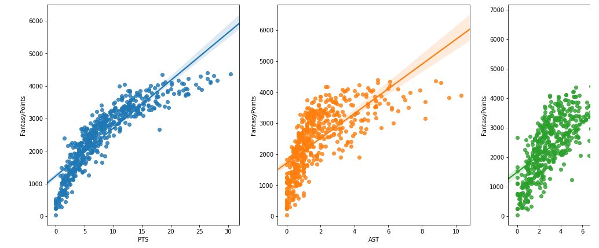
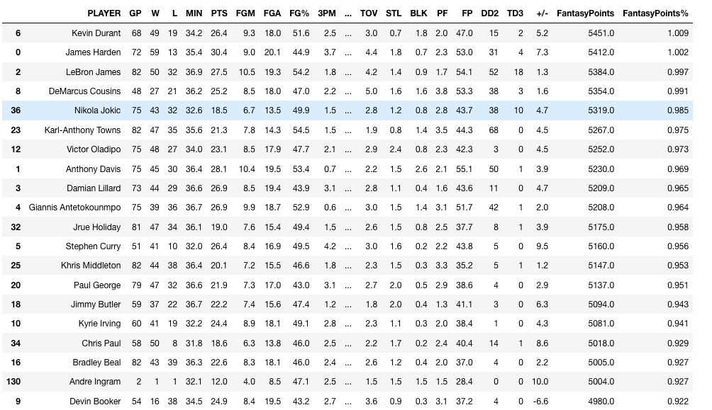

# ESPN Fantasy Basketball

Analyzing NBA Players for Fantasy Perfomance by Categorie. These Notebooks and Python Scripts mainly use Pandas and Seaborn to peform various calculations and plots of player perfomance.

Strengths:
- Using Data to predict Perfomance

Weaknesses:
- Player Perfomance of season 2017-2018 must not fully correlate perfomance of this season.
- Data could not fully represent the old perfomance due to injuries and coaching decisions to bench players.

## ToDo

- Check the team for calculating each players ranking (If there is another player better or in top 100 get 75% score, if there are 2 give 50%, if there are 4+ give 0%)
- Update more for metrics